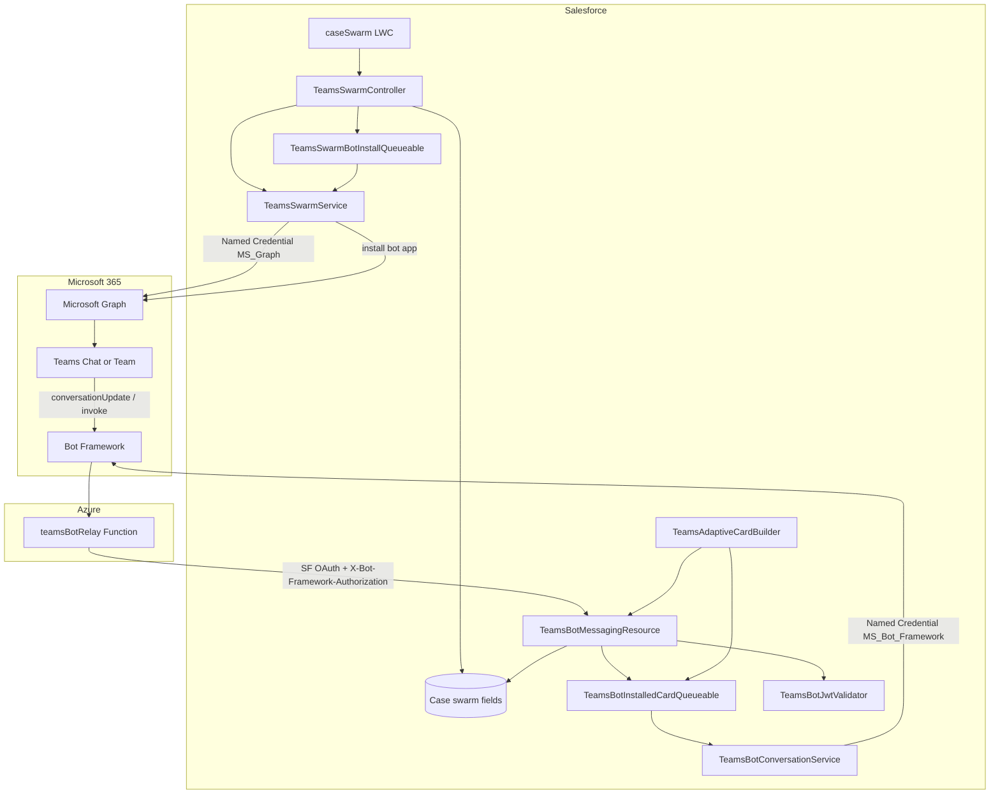
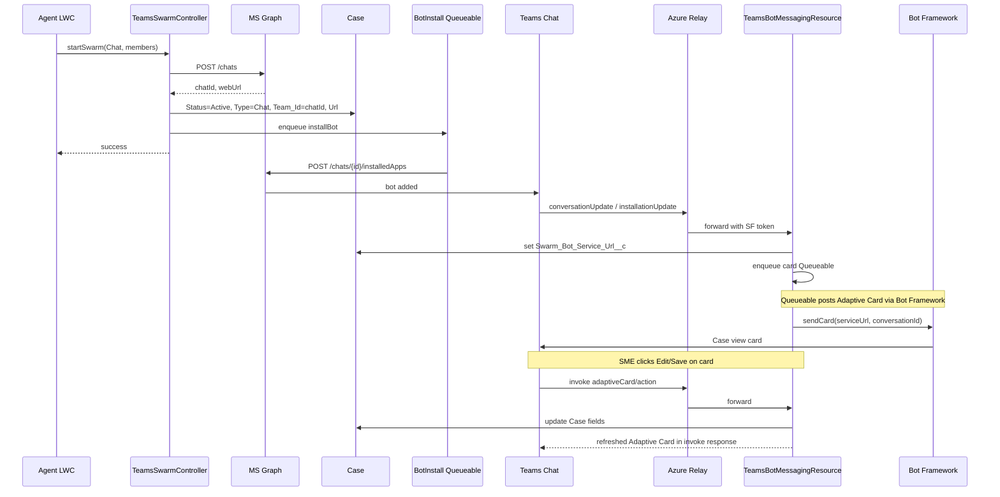
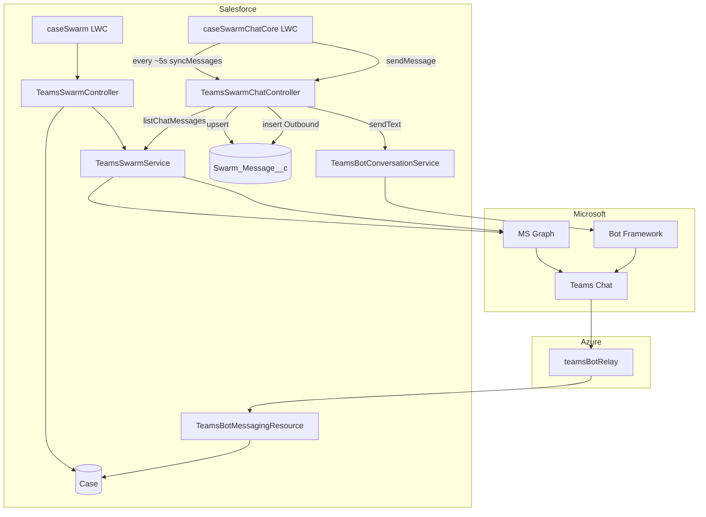
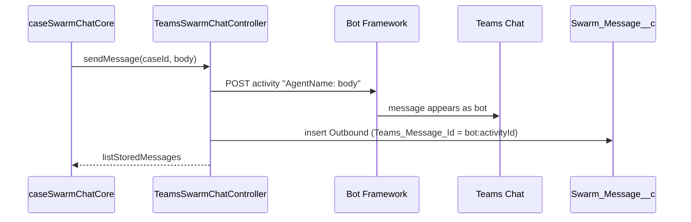
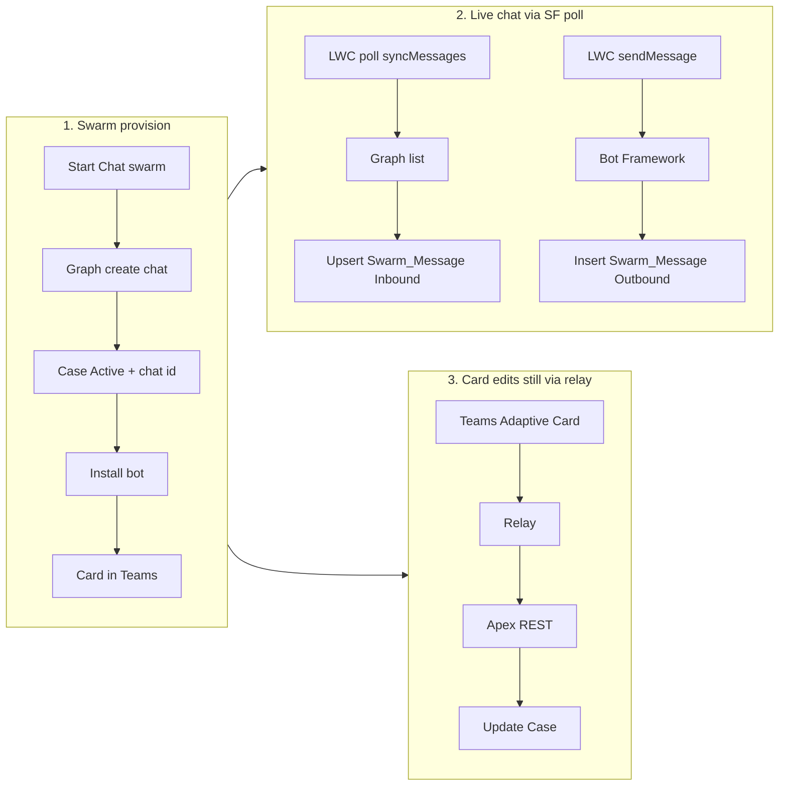

# Case Swarm — Architecture & Data Flow

**Last updated:** 2026-07-23

Two views:

1. **Case swarming alone** — create Team/Chat, members, bot + Adaptive Card (no SF↔Teams chat bridge).
2. **Case swarming + Salesforce chat polling** — same as (1), plus Apex Graph poll / send that creates `Swarm_Message__c` during the session.

> **Note:** Production can also use the **Azure chat bridge** (LWC → Azure → Graph/Bot) with optional end-of-session `persistTranscript`. That path is documented in [Case-Swarm-Chat-Bridge-Options-and-Limits.md](./Case-Swarm-Chat-Bridge-Options-and-Limits.md). This document focuses on **swarm alone** and the **classic SF polling** chat path (`Use_Azure_Chat_Bridge__c = false`).

---

## 1. Case swarming alone

### 1.1 High-level architecture



### 1.2 Case fields written by swarming

| Field | Purpose |
| --- | --- |
| `Swarm_Status__c` | Provisioning / Active / Failed |
| `Swarm_Type__c` | `Team` or `Chat` |
| `Swarm_Team_Id__c` | Team/group id or **chat id** |
| `Swarm_Group_Id__c` | M365 group id (Team path) |
| `Swarm_Team_Url__c` | Deep link into Teams |
| `Swarm_Bot_Service_Url__c` | Bot Framework `serviceUrl` (Chat path) |
| `Swarm_Bot_Install_Error__c` | Bot install failure text (non-fatal) |

No `Swarm_Message__c` in this view — swarming alone does not store a chat transcript.

### 1.3 Data flow — Chat swarm (typical)



### 1.4 Data flow — Team swarm (summary)

```mermaid
sequenceDiagram
  participant Agent as Agent LWC
  participant Apex as TeamsSwarmController
  participant Graph as MS Graph
  participant Case as Case
  participant Sched as Provision Scheduler/Queueable

  Agent->>Apex: startSwarm(Team, members)
  Apex->>Graph: POST /groups
  Apex->>Case: Status=Provisioning, Group/Team ids, Url
  Apex->>Sched: schedule enableTeam retries
  Sched->>Graph: PUT /groups/{id}/team until ready
  Sched->>Graph: add members
  Sched->>Case: Status=Active
  Note over Agent,Case: Open in Teams link; no bot card bridge for Team path today
```

### 1.5 Auth surfaces (swarm alone)

| Named Credential / path | Used for |
| --- | --- |
| `MS_Graph` | Create chat/group/team, members, install bot app |
| `MS_Bot_Framework` | Post Adaptive Card as the bot |
| Azure relay → Connected App | Inbound Bot Framework activities to Apex REST |

---

## 2. Case swarming + SF polling chat sync (transcript during session)

This is the path when **`Use_Azure_Chat_Bridge__c = false`** (or Azure session fails and LWC falls back).

Live UI polls Salesforce Apex; Apex calls Graph; **`Swarm_Message__c` is created/updated during the chat**, not only at the end.

### 2.1 High-level architecture



### 2.2 Components

| Piece | Role |
| --- | --- |
| Swarm create | Same as section 1 (Chat swarm + bot + card) |
| `caseSwarmChatCore` | Poll + composer |
| `syncMessages` | Graph list → upsert inbound (skips bot/application rows) |
| `sendMessage` | Bot Framework send → **insert** Outbound `Swarm_Message__c` |
| `Swarm_Message__c` | Transcript rows (`Direction__c` Inbound/Outbound, `Teams_Message_Id__c` external id) |

### 2.3 Data flow — send from Salesforce



**SF cost per send:** 1 Apex HTTP callout (Bot Framework) + 1 DML insert.

### 2.4 Data flow — receive from Teams (SF poll)

```mermaid
sequenceDiagram
  participant SME as SME in Teams
  participant Teams as Teams Chat
  participant UI as caseSwarmChatCore
  participant Apex as TeamsSwarmChatController
  participant Graph as MS Graph
  participant Msg as Swarm_Message__c

  SME->>Teams: posts message
  Note over UI: setInterval ~5s while chatEnabled
  UI->>Apex: syncMessages(caseId)
  Apex->>Graph: GET /chats/{id}/messages?$top=50
  Graph-->>Apex: message list
  Note over Apex: Skip application/bot rows; upsert human messages as Inbound
  Apex->>Msg: upsert Swarm_Message__c
  Apex-->>UI: full stored list
  UI->>UI: render bubbles; unread event if new Inbound
```

**SF cost per poll tick:** 1 Apex HTTP callout (Graph) + possible DML upserts.  
**~45 min open ≈ ~540 Graph callouts** from Salesforce (not Daily REST API).

### 2.5 Exact code locations — SF chat poll (when Azure bridge is OFF)

**Condition:** `useAzureBridge === false` (CMDT `Use_Azure_Chat_Bridge__c = false`, or Azure session fallback).

There is **no Graph webhook**. Inbound Teams messages are discovered only when this poll runs.

| Step | File | Lines (approx.) | What it does |
| --- | --- | --- | --- |
| 1. Poll interval | `force-app/.../lwc/caseSwarmChatCore/caseSwarmChatCore.js` | `APEX_SYNC_INTERVAL_MS = 5000` (~L33–34) | 5 second cadence for Apex path |
| 2. Start timer | same | `startPolling()` (~L349–360) | `setInterval` → `syncQuietly()` |
| 3. Choose Apex vs Azure | same | `syncQuietly()` (~L413–419) | If not Azure → `fetchApexSync()` |
| 4. Call Apex | same | `fetchApexSync()` (~L433–435) | `syncMessages({ caseId })` |
| 5. Aura entry | `TeamsSwarmChatController.cls` | `syncMessages` (~L199–202) | `upsertFromGraph(caseId, false)` |
| 6. Graph HTTP callout | `TeamsSwarmService.cls` | `listChatMessages` (~L253–260) | `GET /v1.0/chats/{id}/messages?$top=50` via Named Credential `MS_Graph` |
| 7. Persist | `TeamsSwarmChatController.cls` | `upsertFromGraph` | Upsert `Swarm_Message__c` (Inbound; skip `from.application`) |

**Call chain (copy/paste for reviews):**

```text
caseSwarmChatCore.startPolling()          // setInterval every 5000 ms
  -> syncQuietly()                        // useAzureBridge ? Azure : Apex
  -> fetchApexSync()                      // SF poll path only
  -> TeamsSwarmChatController.syncMessages(caseId)
  -> upsertFromGraph(caseId, includeApplicationMessages=false)
  -> TeamsSwarmService.listChatMessages(chatId, 50)
  -> Http.send GET callout:MS_Graph/.../chats/{id}/messages
  -> upsert Swarm_Message__c
```

**Not a Graph webhook:** Microsoft Graph does not POST chat messages to Salesforce. On the classic poll path, Salesforce (or Azure) **pulls** Graph on a timer. With Option D enabled, Bot Framework delivers `type=message` to the relay, which pushes via Azure SignalR to the LWC — still not a Graph change-notification subscription.

**Contrast — Azure bridge ON:** same `startPolling()` / `syncQuietly()`, but L419 uses `fetchAzureHistory()` (browser → Azure Function → Graph). That path does **not** call `syncMessages` and does **not** write `Swarm_Message__c` on each tick.

### 2.6 End-to-end with swarm + SF chat poll



### 2.7 What creates `Swarm_Message__c` (SF polling mode)

| Event | Writer | Timing |
| --- | --- | --- |
| Agent sends from LWC | `sendMessage` insert | **Immediate** |
| SME posts in Teams | `syncMessages` upsert | **Next poll (~5s)** |
| Bot/application Graph rows | Skipped in `syncMessages` | N/A (Outbound already from send) |
| Adaptive Card edit | Case fields only | No chat message row |

### 2.8 Limits snapshot (SF polling chat)

| Meter | Behavior |
| --- | --- |
| Apex callouts | High while panel open (poll) + 1 per send |
| Daily REST API | Low for chat (relay only for bot install/card invoke) |
| DML | Per new inbound on poll + per outbound send |

---

## 3. Side-by-side

| Concern | Swarm alone | Swarm + SF chat poll |
| --- | --- | --- |
| Creates Team/Chat | Yes | Yes |
| Bot + Case card | Chat yes | Chat yes |
| Live SF↔Teams messaging UI | No (Open in Teams) | Yes |
| `Swarm_Message__c` during session | No | **Yes** |
| Graph list from Apex while open | No | **Every ~5s** |
| Bot send from Apex | Card only | Card + chat text |

---

## 4. Related code

| Area | Path |
| --- | --- |
| Start swarm | `TeamsSwarmController`, `TeamsSwarmService`, `caseSwarm` |
| Bot install / card | `TeamsSwarmBotInstallQueueable`, `TeamsBotMessagingResource`, `TeamsBotInstalledCardQueueable` |
| Relay | `relay/src/functions/teamsBotRelay.js` |
| SF chat poll (exact) | See §2.5 — `caseSwarmChatCore` L349–435 → `TeamsSwarmChatController.syncMessages` → `TeamsSwarmService.listChatMessages` L253–260 |
| Transcript object | `Swarm_Message__c` |

---

## 5. Flag reminder

| `Use_Azure_Chat_Bridge__c` | Chat live path |
| --- | --- |
| `false` | **This document §2** — SF Apex poll + immediate `Swarm_Message__c` |
| `true` | Azure `chatHistory` / `chatSend`; transcript only if `persistTranscript` on close (separate flow) |

---

## 6. Is there a webhook / push path?

**No Microsoft Graph change-notification subscription** is used for chat messages.

| Mechanism | Used for |
| --- | --- |
| LWC `setInterval` → Apex `syncMessages` → Graph GET | SF poll path (this document §2.5) |
| LWC → Azure `chatHistory` → Graph GET | Azure bridge poll path (`Use_Azure_SignalR__c = false`) |
| Bot Framework `type=message` → Azure relay → **Azure SignalR** → LWC | Option D push (`Use_Azure_SignalR__c = true`) |
| Bot Framework POST → Azure relay → Apex REST | Bot install + Adaptive Card invoke only |

Inbound chat text is **pull** (poll) unless Option D is enabled. Option D is Bot Framework activity push + SignalR — still not a Graph webhook. See [Case-Swarm-Chat-Bridge-Options-and-Limits.md](./Case-Swarm-Chat-Bridge-Options-and-Limits.md) §8.
