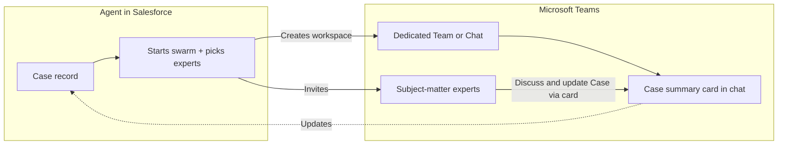
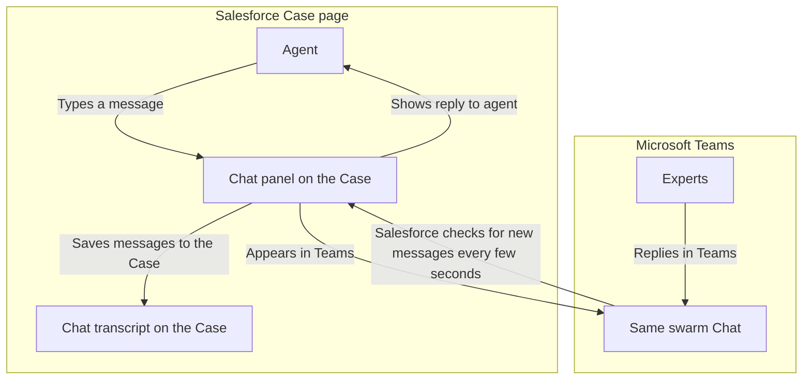
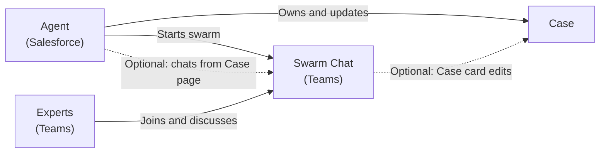

# Case Swarm — Business Overview

**Audience:** Business / process owners  
**Purpose:** How Case Swarm works, in plain language

**Presentation pack**

| File | Use |
| --- | --- |
| [Case-Swarm-Business-Overview.pdf](./Case-Swarm-Business-Overview.pdf) | Slide-style PDF to present |
| [case-swarm-business-swarm-only.png](./case-swarm-business-swarm-only.png) | Diagram A — paste into PowerPoint |
| [case-swarm-business-sf-chat-poll.png](./case-swarm-business-sf-chat-poll.png) | Diagram B — paste into PowerPoint |

---

## What is Case Swarm?

When a Case needs help from experts, an agent can start a **swarm** in Microsoft Teams. Experts join a dedicated Team or Chat, see the Case context, and collaborate—without bouncing emails.

There are two ways the product can work for messaging:

| Mode | What the business sees |
| --- | --- |
| **A. Swarm only** | Collaboration happens **in Teams**. Salesforce holds the Case and a link to open Teams. |
| **B. Swarm + chat in Salesforce** | Agent can also message from the **Case page** in Salesforce. Messages sync with Teams, and a transcript is stored on the Case. |

---

## Diagram A — Case Swarm only (collaborate in Teams)

### What happens (simple steps)

1. Agent opens a Case and starts a swarm.  
2. Salesforce creates a **Team** or **Chat** in Microsoft Teams and invites the selected experts.  
3. Experts work in Teams. For a Chat swarm, they see a **Case card** they can use to view or edit key Case fields.  
4. The Case in Salesforce keeps status and a link: **Open in Teams**.  
5. **Conversation itself stays in Teams**—Salesforce does not keep a full chat transcript in this mode.

---

## Diagram B — Case Swarm + chat inside Salesforce (polling sync)

### What happens (simple steps)

1. Same as Diagram A: swarm Chat is created and experts are invited.  
2. Agent can chat from the **Case page** without leaving Salesforce.  
3. When the agent sends a message → it appears in the Teams chat (as the swarm bot).  
4. When an expert replies in Teams → Salesforce **looks for new messages every few seconds** and shows them in the Case chat panel.  
5. Each send/receive is **saved as a transcript** on the Case (`Swarm Message` records) so the business can review history later.

### How messages become Case history

| Who | Action | When it appears in Salesforce transcript |
| --- | --- | --- |
| Agent | Sends from Case chat | **Right away** |
| Expert | Sends from Teams | **Within a few seconds** (next automatic check) |

---

## Side-by-side for decision makers

```mermaid
flowchart TB
  subgraph Alone["A. Swarm only"]
    A1["Case in Salesforce"] --> A2["Team or Chat in Teams"]
    A2 --> A3["Experts collaborate in Teams"]
    A3 --> A4["Case link + optional Case card"]
    A4 --> A5["No full chat transcript in Salesforce"]
  end

  subgraph WithChat["B. Swarm + Salesforce chat"]
    B1["Case in Salesforce"] --> B2["Same Chat in Teams"]
    B2 --> B3["Agent chats from Case page"]
    B3 --> B4["Experts chat in Teams"]
    B4 --> B5["Messages sync every few seconds"]
    B5 --> B6["Full transcript stored on the Case"]
  end
```

| Question | Swarm only | Swarm + SF chat |
| --- | --- | --- |
| Where do experts talk? | Teams | Teams |
| Can the agent chat from the Case page? | No (opens Teams) | **Yes** |
| Is there a searchable transcript on the Case? | No | **Yes** |
| Best when… | Experts live in Teams; Case stays the system of record | Agent must stay in Salesforce and you need an audit trail |

---

## One picture of the people involved

---

## Talking points for a presentation

1. **Swarm** = temporary collaboration space tied to one Case.  
2. **Experts stay in Teams**; **agent can stay in Salesforce** if chat-on-Case is enabled.  
3. **Swarm only** = lighter; transcript lives in Teams.  
4. **Swarm + SF chat** = agent productivity + **Case transcript** for compliance/handoffs; Salesforce checks Teams every few seconds for new replies.  
5. Adaptive **Case card** in Chat swarms lets experts update the Case without logging into Salesforce.

---

*Technical detail for IT is in `Case-Swarm-Architecture-and-Data-Flows.md` and `Case-Swarm-Chat-Bridge-Options-and-Limits.md`.*
