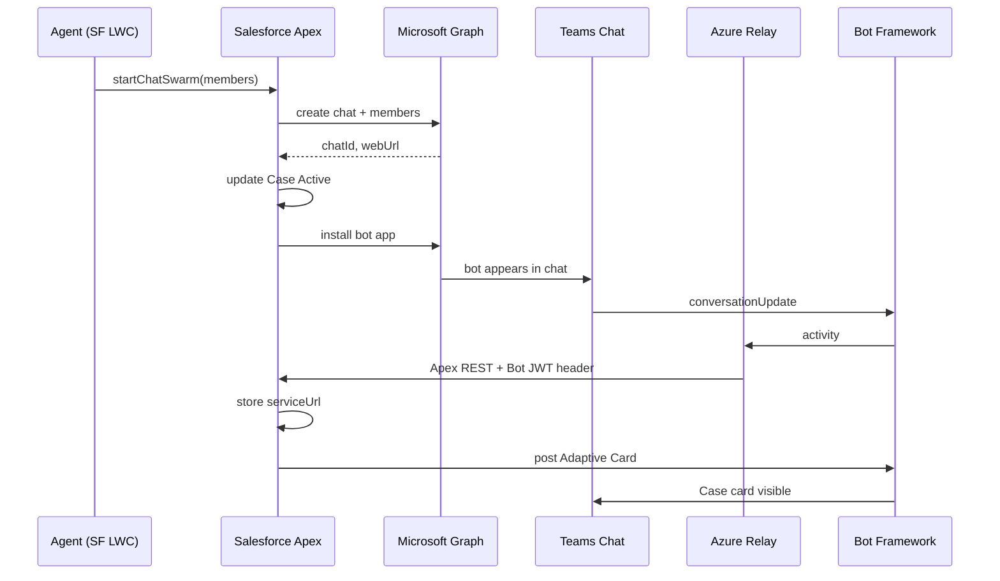
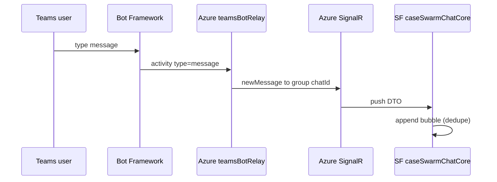
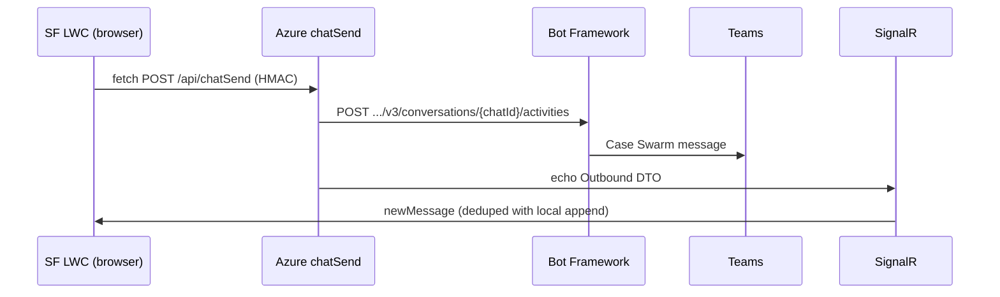

# Case Swarm — Data Flows Explained (First-Time Guide)

**Audience:** Anyone seeing this integration for the first time  
**Last updated:** 2026-07-24  
**Current live chat path:** Azure bridge + SignalR (Option D)

This guide explains **how messages and swarm setup move** across three applications, in plain language, with exact hop order and where the code lives.

---

## 1. Start with the big picture

Case Swarm does two related jobs:

1. **Swarming** — create a Microsoft Teams **Team** or **group Chat** for a Case, add SMEs, install the bot, show a Case Adaptive Card.
2. **Live chatting** — let a Salesforce agent talk with that Teams chat from the Case page (without leaving Salesforce).

Everything always involves up to **three applications**:

| # | Application | What it owns |
| --- | --- | --- |
| 1 | **Salesforce** | Case record, agent UI (LWCs), Apex services, Adaptive Card REST endpoint |
| 2 | **Azure** | Function App relay + SignalR — **dumb plumbing** (no business rules for chat text) |
| 3 | **Microsoft 365** | Teams chat UI, Microsoft Graph, Bot Framework |

```text
┌─────────────┐      ┌──────────────────────┐      ┌─────────────────┐
│ Salesforce  │ ←──→ │ Azure (relay/SignalR)│ ←──→ │ Teams / Graph / │
│  Case + LWC │      │  Functions           │      │ Bot Framework   │
└─────────────┘      └──────────────────────┘      └─────────────────┘
```

**Rule of thumb**

- **Salesforce** decides *what* (which Case, which users, what card fields).
- **Azure** moves bytes and auth headers; pushes live events.
- **Microsoft** is the real chat room and identity directory.

---

## 2. Two Microsoft “doors” (do not mix them up)

Microsoft is reached through **two separate auth doors**:

| Door | Credential / config | Used for |
| --- | --- | --- |
| **Microsoft Graph** | Salesforce Named Credential `MS_Graph` (and `GRAPH_*` on Azure for history) | Create chat/team, add members, **install** the Teams app, **list** chat history |
| **Bot Framework** | Salesforce Named Credential `MS_Bot_Framework` (and `MICROSOFT_APP_*` on Azure) | **Post** messages/cards *as the Case Swarm bot*; **receive** Teams activities at the relay |

Why two doors?

- Graph app-only **cannot** reliably post live chat messages the way this product needs (bot-authored chat).
- So **outbound live text** and **Adaptive Cards** go through **Bot Framework**, not Graph “send message”.

---

## 3. What is a “callout”? (important)

People say “callout” in two ways. In Salesforce they usually mean something specific.

| Term | Meaning | Counts against Salesforce callout limits? |
| --- | --- | --- |
| **Salesforce Apex callout** | Apex runs `Http.send()` (often via a Named Credential) on the **Salesforce server** | **Yes** |
| **Browser network request** | LWC uses `fetch()` from the **agent’s browser** to Azure | **No** (not an Apex callout) |
| **Azure → Microsoft HTTPS** | Function App calls Graph or Bot Framework | **No** (Azure’s traffic, not Salesforce) |

### Live outbound send (Azure bridge) — your production path

```text
Browser LWC  --fetch-->  Azure Function  --HTTPS-->  Bot Framework  -->  Teams
              ↑                              ↑
         not Apex                      not Salesforce
```

So: **there is still HTTP traffic**, but it is **not** a Salesforce Apex callout on send.

### Apex fallback send (Azure bridge off)

```text
LWC  -->  Apex sendMessage  --Http.send / MS_Bot_Framework-->  Bot Framework  -->  Teams
                              ↑
                         THIS is a Salesforce callout
```

---

## 4. Identity fields on the User

| Field | Used for |
| --- | --- |
| `User.Azure_AD_Email_Id__c` | Adding people to chats/teams (Graph accepts UPN/email) |
| `User.Azure_AD_Object_Id__c` | Optional Teams `onBehalfOf` MRI (`8:orgid:{id}`) on outbound bot posts |

If email is blank, SME add fails. If object id is blank, outbound still works; Teams just may not show “Name via Case Swarm” attribution.

---

## 5. Flow A — Start a **Chat** swarm (from zero)

This is the usual path for live chat.

### Story in one sentence

Agent starts a Quick Chat swarm → Salesforce asks Graph to create a chat → Case is marked Active → bot is installed → Teams tells Azure the bot joined → Azure tells Salesforce → Salesforce stores the bot `serviceUrl` and posts the Case card into Teams.

### Step-by-step

| Step | App | What happens |
| --- | --- | --- |
| 1 | Salesforce | Agent uses `caseSwarm` LWC; picks SMEs; clicks start Chat swarm |
| 2 | Salesforce | `TeamsSwarmController` → `TeamsSwarmService` |
| 3 | Salesforce → Graph | **Apex callout** via `MS_Graph`: create chat, add members (by `Azure_AD_Email_Id__c`) |
| 4 | Microsoft | Teams group chat exists; Graph returns `chatId` + URL |
| 5 | Salesforce | Case fields: `Swarm_Status__c=Active`, `Swarm_Type__c=Chat`, `Swarm_Team_Id__c=chatId`, `Swarm_Team_Url__c` |
| 6 | Salesforce → Graph | Queueable installs the Teams app into the chat (RSC permission for reading messages without @mention) |
| 7 | Microsoft → Azure | Bot Framework sends `conversationUpdate` (bot added) to the bot messaging endpoint |
| 8 | Azure → Salesforce | `teamsBotRelay` rewrites auth (see §9) and POSTs to Apex REST `/services/apexrest/teamsbot/messages` |
| 9 | Salesforce | `TeamsBotMessagingResource` validates Bot JWT; writes `Swarm_Bot_Service_Url__c` |
| 10 | Salesforce → Bot Framework | Queueable posts the Case **Adaptive Card** as the bot (`TeamsBotConversationService`) |

### Sequence (Chat swarm)



### Main code

| Piece | Location |
| --- | --- |
| UI start | `force-app/.../lwc/caseSwarm/` |
| Controller | `TeamsSwarmController.cls` |
| Graph create/install | `TeamsSwarmService.cls` |
| Bot install async | `TeamsSwarmBotInstallQueueable.cls` |
| Inbound bot activity | `relay/src/functions/teamsBotRelay.js` → `TeamsBotMessagingResource.cls` |
| First card | `TeamsBotInstalledCardQueueable.cls` → `TeamsBotConversationService.cls` |

### Case fields after a successful Chat swarm

| Field | Meaning |
| --- | --- |
| `Swarm_Team_Id__c` | Teams **chat id** (also SignalR group name later) |
| `Swarm_Team_Url__c` | “Open in Teams” link |
| `Swarm_Bot_Service_Url__c` | Bot Framework region base URL needed to **send** later |
| `Swarm_Status__c` / `Swarm_Type__c` | `Active` / `Chat` |

---

## 6. Flow B — Start a **Team** swarm (summary)

Same idea, different Microsoft objects:

1. Graph creates an M365 **group**, then enables a **Team** (can be async → provision Queueable/scheduler retries).
2. Members added; Case gets group/team ids and URL.
3. **No** live SF↔Teams text bridge for Team swarms today — agents use “Open in Teams”.
4. Chat Adaptive Card / SignalR live chat is **Chat-swarm only**.

---

## 7. Flow C — Open live chat in Salesforce

Flags on `Teams_Bot_Config__mdt.Default`:

- `Use_Azure_Chat_Bridge__c = true`
- `Use_Azure_SignalR__c = true` (Option D)

### Story

Agent opens Swarm Chat on the Case → Salesforce mints a short-lived HMAC session → browser loads history once from Azure → browser connects to SignalR → joins the chat’s group → waits for pushes (no continuous Graph polling while connected).

### Step-by-step

| Step | App | Mechanism | What happens |
| --- | --- | --- | --- |
| 1 | Salesforce | Apex (no Graph) | `getChatBridgeSession` returns token, `chatId`, `serviceUrl`, Azure base URL, SignalR paths, sender name/object id |
| 2 | Browser → Azure | `fetch` | `GET /api/chatHistory` (one-shot) |
| 3 | Azure → Graph | HTTPS | List messages for `chatId`; return DTOs |
| 4 | Browser → Azure | `fetch` | `POST /api/negotiate` |
| 5 | Azure → SignalR | Binding | Returns WebSocket URL + access token (hub `swarmChat`) |
| 6 | Browser → SignalR | WebSocket | Native LWC client connects (`caseSwarmChatSignalR.js`) |
| 7 | Browser → Azure | `fetch` | `POST /api/joinChat` → add user to SignalR group = `chatId` |
| 8 | Salesforce UI | — | Badge like **Live: SignalR push** |

### If SignalR disconnects

LWC falls back to polling Azure `chatHistory` (Graph behind Azure) until push is back. That poll is **browser → Azure**, not Apex Graph every few seconds.

### Main code

| Piece | Location |
| --- | --- |
| Chat UI | `force-app/.../lwc/caseSwarmChatCore/caseSwarmChatCore.js` |
| Session | `TeamsSwarmChatController.getChatBridgeSession` |
| History Function | `relay/src/functions/chatHistory.js` + `relay/src/graphChat.js` |
| Negotiate / join | `relay/src/functions/negotiate.js`, `joinChat.js` |
| SignalR client | `caseSwarmChatSignalR.js` |

---

## 8. Flow D — Inbound message (Teams → Salesforce)

### Story

Someone types in Teams → Bot Framework delivers the activity to Azure → Azure pushes a small JSON DTO over SignalR → the open LWC appends the bubble. **No Graph on each inbound message** while SignalR is healthy. **No `Swarm_Message__c` write** on the live Azure path.

### Step-by-step

| Step | App | Mechanism | What happens |
| --- | --- | --- | --- |
| 1 | Teams | User types | Normal chat message (RSC allows delivery without @mentioning the bot) |
| 2 | Microsoft → Azure | Bot Framework HTTP | `type=message` activity hits `teamsBotRelay` |
| 3 | Azure | SignalR output | Group = `chatId`, target = `newMessage`, payload = DTO |
| 4 | Azure → Browser | WebSocket | LWC `appendPushedMessage` (dedupe by id) |
| 5 | Salesforce | UI only | Inbound bubble appears |

### Sequence



### Main code

| Piece | Location |
| --- | --- |
| Receive activity | `relay/src/functions/teamsBotRelay.js` |
| DTO + SignalR helper | `relay/src/signalrHub.js` |
| Append in UI | `caseSwarmChatCore.js` → `appendPushedMessage` / `caseSwarmChatMessages.js` |

**Note:** Card **invokes** (Edit Case) still go Relay → **Salesforce Apex REST**. Plain text messages stay in Azure for SignalR and do **not** need Apex per message.

---

## 9. Flow E — Outbound message (Salesforce → Teams) — **no Graph**

This is the flow people ask about most.

### Story

Agent types in Salesforce → browser posts to Azure `chatSend` → Azure posts to **Bot Framework** using the Case’s saved `serviceUrl` + `chatId` → message appears in Teams as **Case Swarm** → Azure also echoes the message on SignalR so the SF UI updates. Graph is **not** called.

### Why Graph is not needed

At swarm time Salesforce already stored:

- `Swarm_Team_Id__c` = conversation id  
- `Swarm_Bot_Service_Url__c` = where to POST bot activities  

That is enough for Bot Framework’s:

`POST {serviceUrl}/v3/conversations/{chatId}/activities`

### Step-by-step (Azure bridge — production)

| Step | App | Mechanism | Salesforce Apex callout? |
| --- | --- | --- | --- |
| 1 | Salesforce LWC | `handleSend` → `sendViaAzure` | No |
| 2 | Browser → Azure | `fetch POST /api/chatSend` + HMAC header | No |
| 3 | Azure | Validate HMAC; build markdown `**Name:** message` | No |
| 4 | Azure → Bot Framework | HTTPS `postActivity` with bot token | No |
| 5 | Microsoft | Teams shows bot message | — |
| 6 | Azure → SignalR | Echo Outbound DTO to group | No |
| 7 | Browser | Append/dedupe outbound bubble | No |

### Exact code places

1. **LWC chooses Azure send** — `caseSwarmChatCore.js` → `handleSend` / `sendViaAzure`  
2. **Azure entry** — `relay/src/functions/chatSend.js` → `sendAgentMessage(...)`  
3. **Bot POST** — `relay/src/botSend.js` → `postActivity` →  
   `{serviceUrl}/v3/conversations/{id}/activities`

### Apex fallback (bridge off or session failure)

| Step | Mechanism | Salesforce Apex callout? |
| --- | --- | --- |
| LWC calls `TeamsSwarmChatController.sendMessage` | Apex | — |
| `TeamsBotConversationService.sendAgentText` | Named Credential `MS_Bot_Framework` | **Yes** |
| Same Bot Framework `/activities` URL | HTTPS | — |

Comment in code states Graph cannot send these live messages (401).

### Sequence (Azure outbound)



---

## 10. Flow F — Adaptive Card Edit Case (still via Salesforce)

Separate from live text chat.

| Step | Path |
| --- | --- |
| 1 | User clicks Edit/Save on the card in Teams |
| 2 | Bot Framework `invoke` → Azure `teamsBotRelay` |
| 3 | Relay → Salesforce Apex REST (`TeamsBotMessagingResource`) |
| 4 | JWT validated; Case found by conversation id = `Swarm_Team_Id__c` (never trust client case id alone) |
| 5 | Case updated; **refreshed card returned in the invoke response** (Teams swaps card in place) |

Business logic for cards stays in Apex. Relay stays plumbing.

---

## 11. Why the Azure relay exists (auth rewrite)

Salesforce’s Apex REST layer treats a normal `Authorization` header as a **Salesforce session**.  
Bot Framework always puts its **Bot JWT** in `Authorization`.

So Bot Framework **cannot** call Salesforce Apex REST directly.

**Relay fix:**

1. Relay gets a **Salesforce OAuth token** (Connected App client credentials).  
2. Puts that token in `Authorization` (Salesforce happy).  
3. Moves the original Bot JWT to `X-Bot-Framework-Authorization`.  
4. `TeamsBotJwtValidator` checks that header.

```text
Bot Framework                Azure Relay                 Salesforce Apex REST
Authorization: Bot JWT  →    Authorization: SF token
                             X-Bot-Framework-Authorization: Bot JWT
```

---

## 12. What gets stored where

| Data | Where | When |
| --- | --- | --- |
| Swarm ids / status / bot serviceUrl | Case fields | Swarm create / bot join |
| Live chat bubbles | LWC memory (browser) | Open session; SignalR / history |
| `Swarm_Message__c` | Salesforce DB | Classic Apex poll/send path; **not** continuous writes on live Azure/SignalR path |
| True chat history | Teams (Microsoft) | Always source of truth |

---

## 13. Cheat sheet — “Who talks to whom?”

| Action | Salesforce Apex callout? | Browser fetch? | Azure → Graph? | Azure/SF → Bot Framework? | SignalR? |
| --- | --- | --- | --- | --- | --- |
| Create Chat swarm | Yes (Graph) | No | No (from SF directly) | Card later yes | No |
| Install bot | Yes (Graph) | No | No | No | No |
| Bot joined / card invoke | Relay→Apex (SF OAuth), not Graph | No | No | Receive + card post | No |
| Open chat history (once) | No | Yes → Azure | Yes | No | No |
| SignalR connect/join | No | Yes → Azure / wss | No | No | Yes |
| Inbound Teams text | No | No (push in) | No | Receive at relay | Yes push |
| Outbound SF text (bridge) | No | Yes → Azure | No | Yes | Yes echo |
| Outbound SF text (Apex fallback) | Yes (Bot NC) | No | No | Yes | No |

---

## 14. Related docs

| Doc | Focus |
| --- | --- |
| [Case-Swarm-Architecture-and-Data-Flows.md](./Case-Swarm-Architecture-and-Data-Flows.md) | Deeper architecture diagrams (includes classic poll path) |
| [Case-Swarm-SignalR-Option-D-Guide.md](./Case-Swarm-SignalR-Option-D-Guide.md) | Setup, permissions, troubleshooting for SignalR |
| [Case-Swarm-Chat-Bridge-Options-and-Limits.md](./Case-Swarm-Chat-Bridge-Options-and-Limits.md) | Options A–G, limits, cost tradeoffs |
| `CLAUDE.md` (repo root) | Engineer-oriented code map |

---

## 15. One-page memory aid

```text
SWARM:   SF Apex --Graph--> Teams chat created --> bot installed
         Teams --Bot--> Azure relay --Apex REST--> store serviceUrl + post card

LIVE OPEN:  SF LWC --fetch--> Azure history (Graph once) --negotiate/join--> SignalR

INBOUND:  Teams --Bot--> Azure relay --SignalR--> SF LWC
          (no Graph per message; no Apex per message)

OUTBOUND: SF LWC --fetch--> Azure chatSend --Bot Framework--> Teams
          (+ SignalR echo). Not Graph. Not SF Apex callout on bridge path.
```

That is the whole product’s traffic pattern in four lines.
