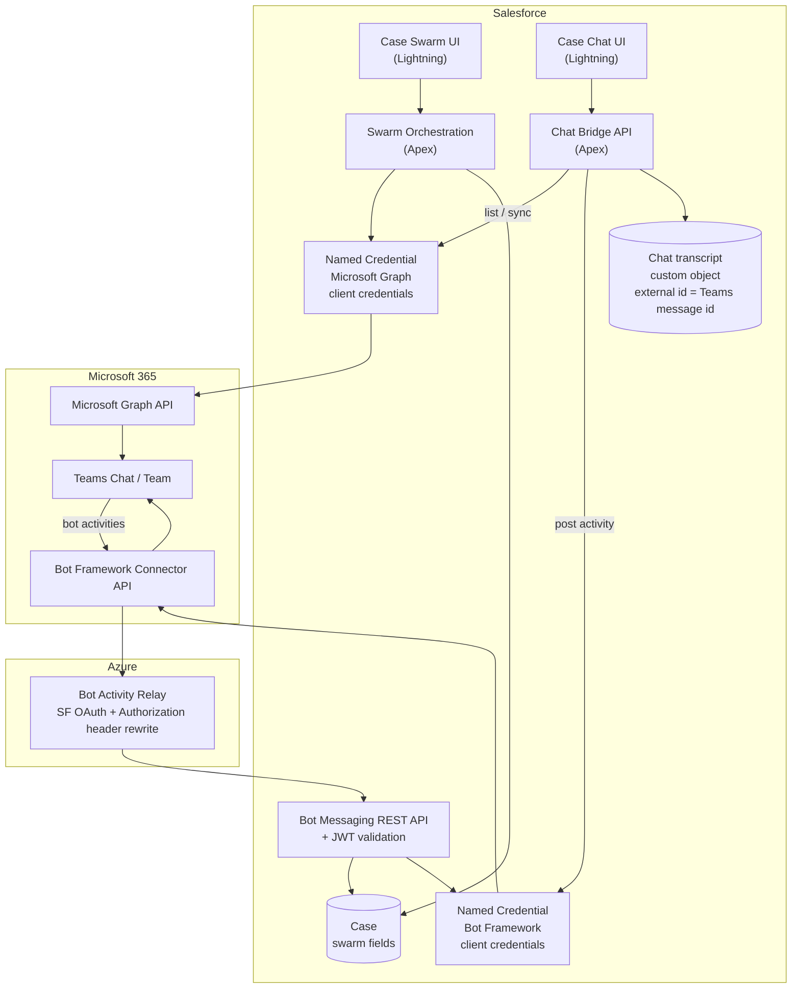
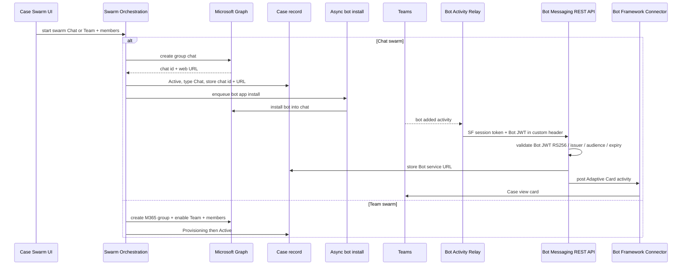

# Case Swarm — Technical Architecture

**Audience:** Solution / technical architects  
**Scope:** Integration mechanics — Salesforce, Azure relay, Microsoft Graph, Bot Framework.  
**Style:** Capability names and protocols (not source file names).

---

## Presentation pack

| Asset | Use |
| --- | --- |
| [Case-Swarm-Technical-Architecture.pdf](./Case-Swarm-Technical-Architecture.pdf) | Landscape slides: **PNG diagrams + boxed text** data flows |
| [case-swarm-tech-swarm-alone.png](./case-swarm-tech-swarm-alone.png) | Visual architecture — provision + Adaptive Card |
| [case-swarm-tech-sf-chat-poll.png](./case-swarm-tech-sf-chat-poll.png) | Visual architecture — Apex poll chat sync |

---

## System context



### Auth surfaces (do not conflate)

| Integration | Protocol | Purpose |
| --- | --- | --- |
| Microsoft Graph Named Credential | OAuth client credentials → Graph | Create chat/group/team, members, list messages, install bot app |
| Bot Framework Named Credential | OAuth client credentials → Bot Connector | Post Adaptive Cards and live chat text **as the bot** |
| Bot Activity Relay → Salesforce | Connected App OAuth + custom Bot JWT header | Inbound Bot Framework activities (platform rejects Bot JWT in `Authorization`) |

**Constraint:** Graph application-only tokens cannot post interactive live chat messages (HTTP 401). Outbound chat text uses Bot Framework.

---

## 1. Case swarming alone — provision + Adaptive Card



### What is stored (swarm alone)

| Store | Content |
| --- | --- |
| Case | Swarm status, type, chat/team ids, Teams URL, Bot service URL, install error |
| Teams | Chat or Team, members, Adaptive Card (Chat path) |
| Chat transcript object | **Not written** in swarm-alone |

### Why the relay exists

Bot Framework always sends `Authorization: Bearer <Bot JWT>`. Salesforce Apex REST interprets `Authorization` as a **Salesforce session** and rejects foreign JWTs before Apex runs. The relay obtains a Salesforce OAuth token for `Authorization` and moves the Bot JWT to a custom header validated in Apex.

---

## 2. Swarm + Salesforce chat polling — sync + transcript

**Mode:** Azure chat bridge feature flag **off** (classic Apex poll path).

```mermaid
sequenceDiagram
  participant UI as Case Chat UI
  participant API as Chat Bridge API
  participant Graph as Microsoft Graph
  participant BF as Bot Framework Connector
  participant T as Chat transcript object
  participant Teams as Teams Chat

  Note over UI: Enabled when Case is Active Chat with chat id + Bot service URL

  loop Every ~5 seconds
    UI->>API: sync inbound
    API->>Graph: GET chat messages top 50
    Graph-->>API: message collection
    Note over API: Skip bot/application rows; upsert human messages as Inbound
    API->>T: upsert by Teams message id
    API-->>UI: ordered transcript DTOs
  end

  UI->>API: send outbound
  API->>BF: POST conversation activity
  BF->>Teams: message appears as bot
  API->>T: insert Outbound row
  API-->>UI: refreshed transcript
```

### Transcript write rules

| Direction | Technical mechanism | When written |
| --- | --- | --- |
| Outbound (agent → Teams) | Bot Framework callout + DML insert | **Immediate** |
| Inbound (Teams → agent) | Graph list + DML upsert | **Next poll (~5s)** |
| Bot/application Graph echoes | Filtered out on sync | Not duplicated |
| Adaptive Card field edit | Bot Messaging REST → Case DML | Case fields only — no transcript row |

### Runtime cost (architect view)

| Operation | Salesforce impact |
| --- | --- |
| Chat panel open ~45 min | ~540 Apex **HTTP callouts** to Graph |
| Each agent send | 1 Bot Framework **callout** + 1 DML |
| Bot install / card invoke | Inbound **Daily REST API** via relay |

**Note:** LWC → Apex poll is **not** Daily REST API consumption; it is **callout** consumption.

---

## Capability map (implementation ↔ technology)

| Capability | Technology |
| --- | --- |
| Case Swarm UI | Lightning Web Component on Case |
| Case Chat UI | Lightning Web Component (panel / widget / utility) |
| Swarm Orchestration | Apex + async Queueable / Scheduled Apex |
| Graph client | Apex HTTP via Named Credential → Microsoft Graph |
| Chat Bridge API | Apex Aura-enabled sync / send |
| Bot Messaging REST API | Apex REST + hand-rolled RS256 JWT validation vs Bot Framework JWKS |
| Bot Activity Relay | Azure Functions (Node) — OAuth to Salesforce + header rewrite |
| Chat transcript | Custom object; external id = Teams message id |
| Identity bridge | User Azure AD email / UPN (not Salesforce User Id) |

---

## Alternate mode (reference only)

When the **Azure chat bridge** feature flag is **on**: the Case Chat UI calls Azure Functions for history (Graph proxy) and send (Bot Framework). Live traffic avoids per-message Apex callouts. Optional end-of-session Apex job can pull Graph once into the transcript object. See Options & Limits doc for tradeoffs.

---

## Architect checklist

1. Separate token audiences: Graph vs Bot Framework.  
2. Bot → Salesforce requires the activity relay (Authorization header conflict).  
3. Member resolution keyed by Azure AD email/UPN on User.  
4. Transcript external id = Teams message id for idempotent upsert.  
5. Apex poll mode trades UX freshness for continuous Graph callouts from Salesforce.
